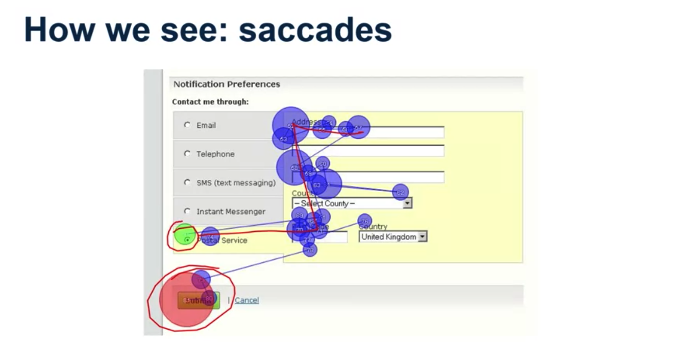
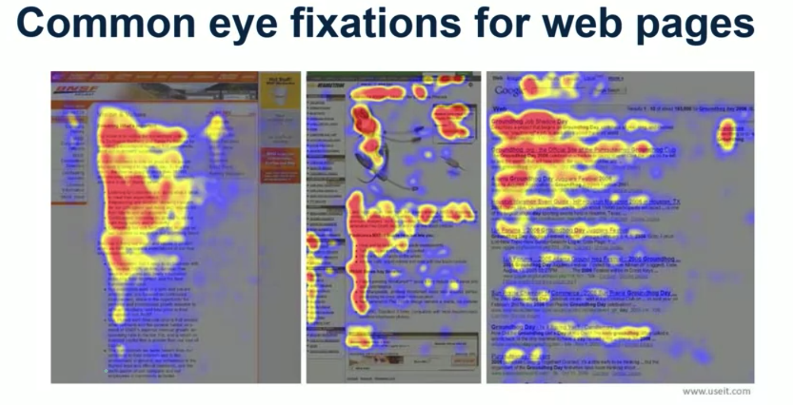

# Visual Perception, Part I

In this lecture, we will focus on visual perception, because most information that we receive in general is conveyed visually and that's especially true when we're talking about graphical user interfaces.

- **How we take in information about the world**
    - Sight 
    - Hearing 
    - Touch 
    - Smell 
    - Taste 
    - and a few others...

- **We will focus on visual perception** 
    - Most information is conveyed visually 
        - Especially in graphical user interfaces

  

 Saccades or sequential eye fixations are how we pick up information from a lot of static images like pages of text or web pages that we perceive online.

 

People don't necessarily read all parts of web pages equally.

What's been shown through a series of studies mostly performed by Jakob Nielsen, is that people tend to follow an F shaped reading pattern when looking at different types of web pages. 

What's being show is a heat map showing how people read pages on the web. 

### Principles 

- Make important info & actions visible 
- Leverage "the read" 
- When evaluation, ask yourself "did they see it?" 

