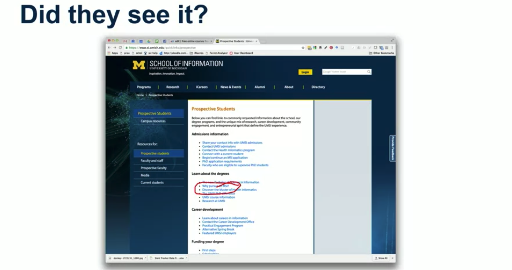
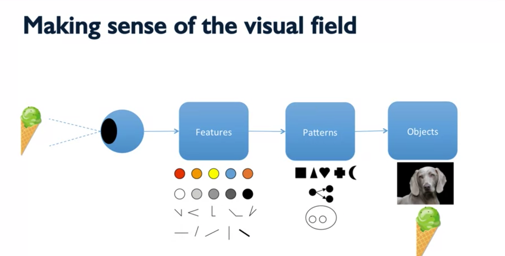
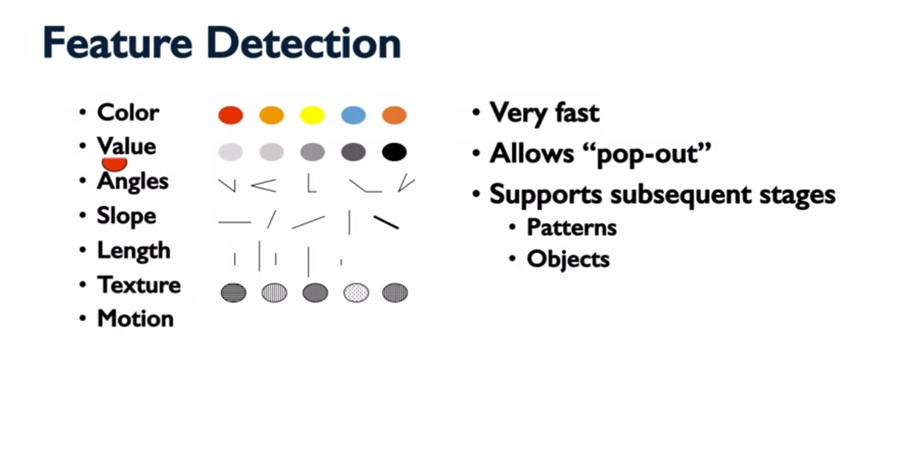
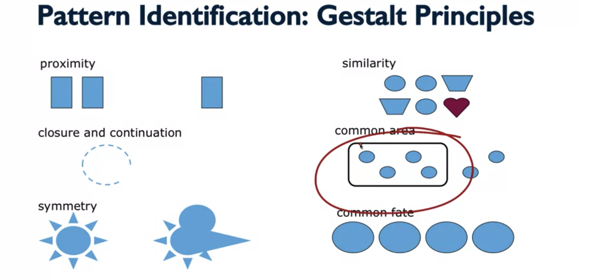
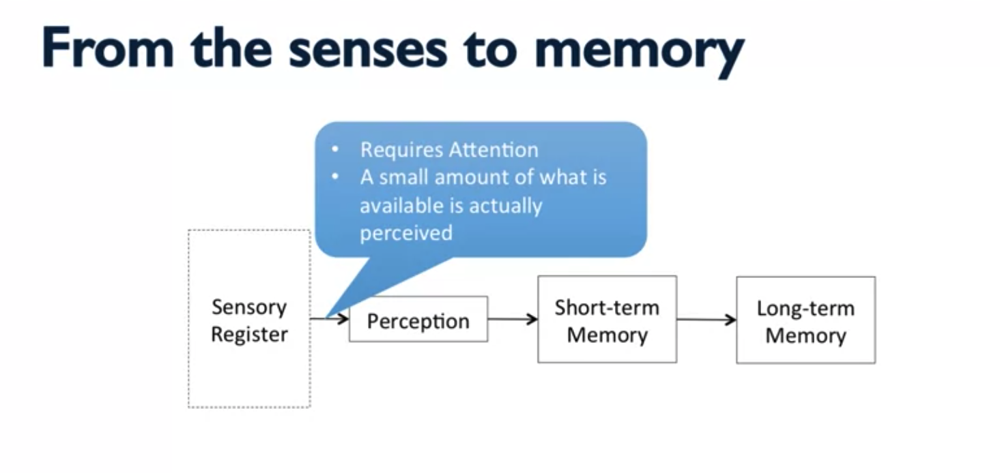
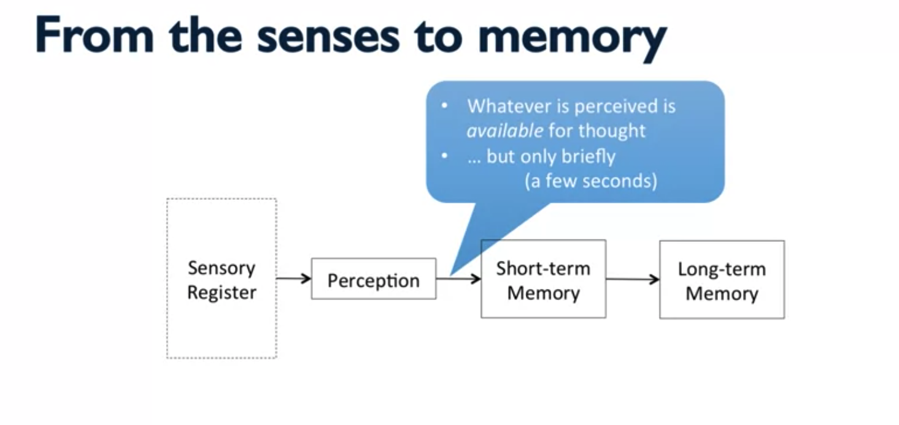
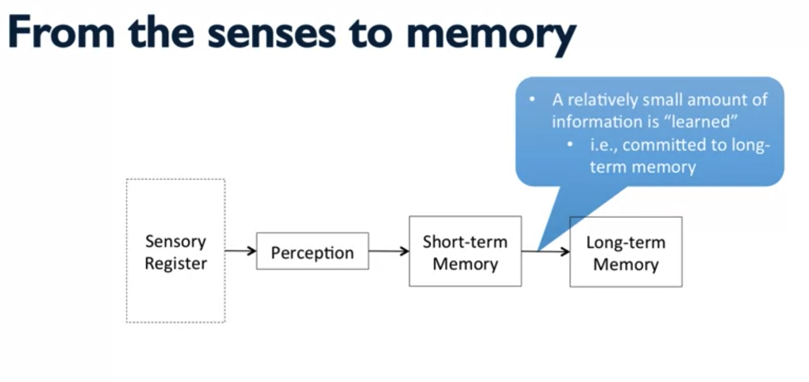

#WEEK 3

## Visual Perception, Part I

In this lecture, we will focus on visual perception, because most information that we receive in general is conveyed visually and that's especially true when we're talking about graphical user interfaces.

- **How we take in information about the world**
    - Sight 
    - Hearing 
    - Touch 
    - Smell 
    - Taste 
    - and a few others...

- **We will focus on visual perception** 
    - Most information is conveyed visually 
        - Especially in graphical user interfaces

  

 Saccades or sequential eye fixations are how we pick up information from a lot of static images like pages of text or web pages that we perceive online.

 

People don't necessarily read all parts of web pages equally.

What's been shown through a series of studies mostly performed by Jakob Nielsen, is that people tend to follow an F shaped reading pattern when looking at different types of web pages. 

What's being show is a heat map showing how people read pages on the web. 

### Principles 

- **Make important info & actions visible** 
    - information that is not immediately visible and perceivable by users, is less likely to be noticed and if extra effort is required to find it, the number of users that will find it and take action on it is going to be reduced significantly.

- **Leverage "the read"** 
 

- **When evaluation, ask yourself "did they see it?"** 
 

---

## Visual Perception, Part II

How the human eye breaks down what it sees. 

We use **proximity** to determine what parts of the visual field ought to be associated with each other and which are likely to be part of a different pattern.

We use **closure and continuation** to complete objects that might be occluded by other objects.

So, when we look at this image of what looks like a sun here, we see it as a single object, a sign with rays coming out of it largely because of the **symmetry** of the object.

We use **similarity** group things into patterns and identify patterns that go together.

When we see things that are grouped into a **common area** that share a common boundary, we're more likely to see those as part of the same pattern as opposed to something else that might be seen as part of a different pattern.

**Common Fate** - We also use movement to group aspects of the visual field into patterns.

**Principles**
- Use "pop out" (primitive features)
- Use Gestalt principles to associate like items 
- Use Gestalt principles to organize for skippability 

---

## Memory, Part I 

In this lecture, we'll be focusing mostly on short-term memory and how that works and in future lectures, we'll focus on long-term memory as well.

**Short-term Memory** 
- Has limited capacity 
    - The "magic number" 7 + || - 2 items (Miller's Law, 1956)
        - Meaning that most people can hold about seven items, in this case, fruit or animals in their short-term memory and depending on individual differences that number can be a little bit higher, a little bit lower.

    - Maybe more like 4 + || - 1 (Cowan, 2001) 

- Information that is not retained is lost 
    - "Retained" means "committed" to long term memory"
    - Also know as "learning"

**Principles**
- Keep lists of options short
    - keep lists of options short especially when users may not know exactly what they're looking for.
- Give users tools for reducing options
    - Where we do need to present lots of options to users, we need to give them tools for reducing the number of options especially when comparing among those options.
- Don't expect users to remember stuff 
    - Finally, we can't expect users to remember stuff that they've seen on previous screens or in other interactions with systems that we're designing when they're engaging in subsequent interactions.

---
## Memory, Part II

