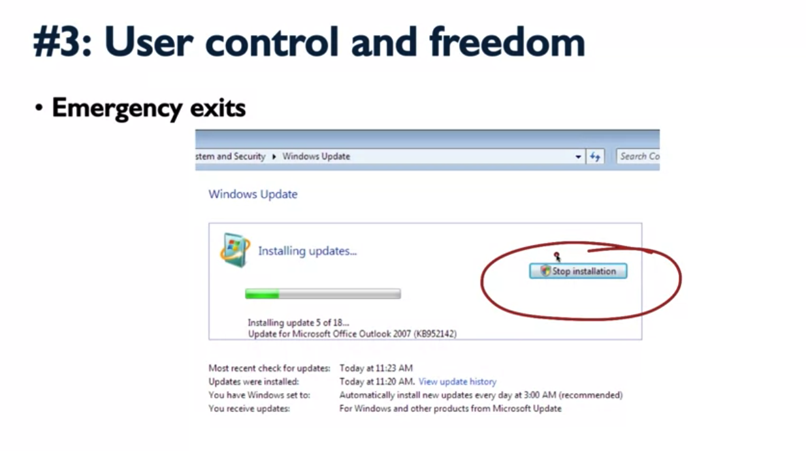
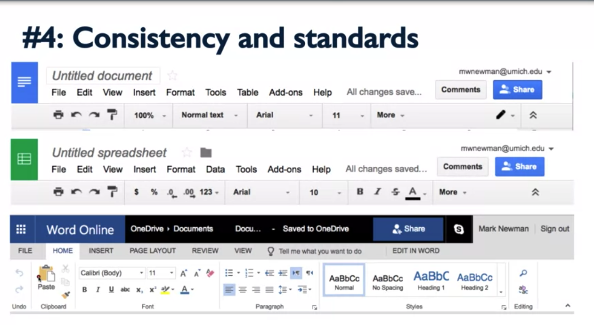
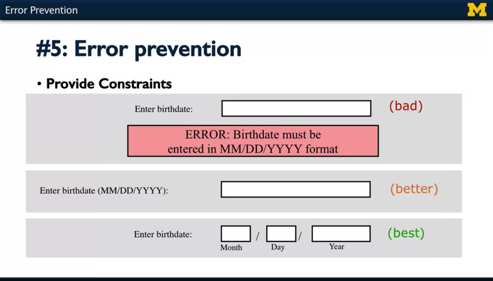
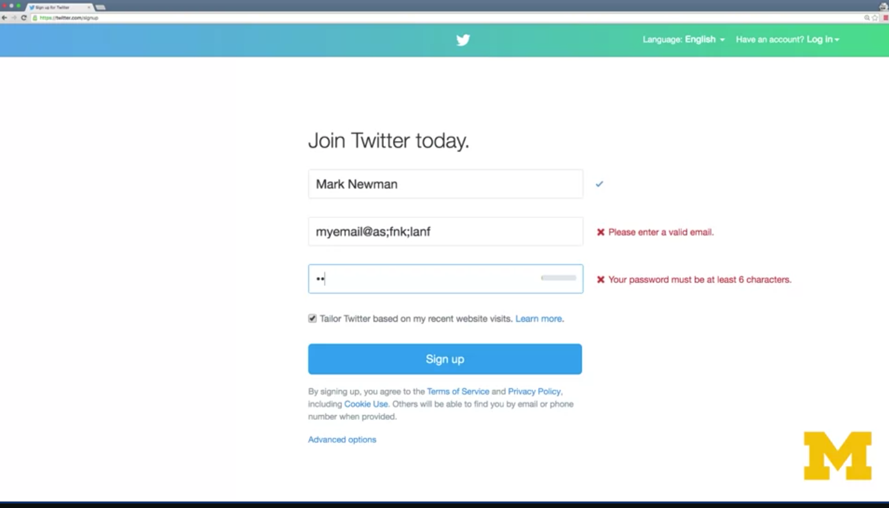
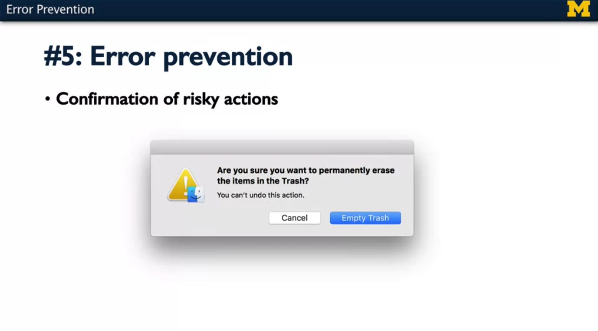
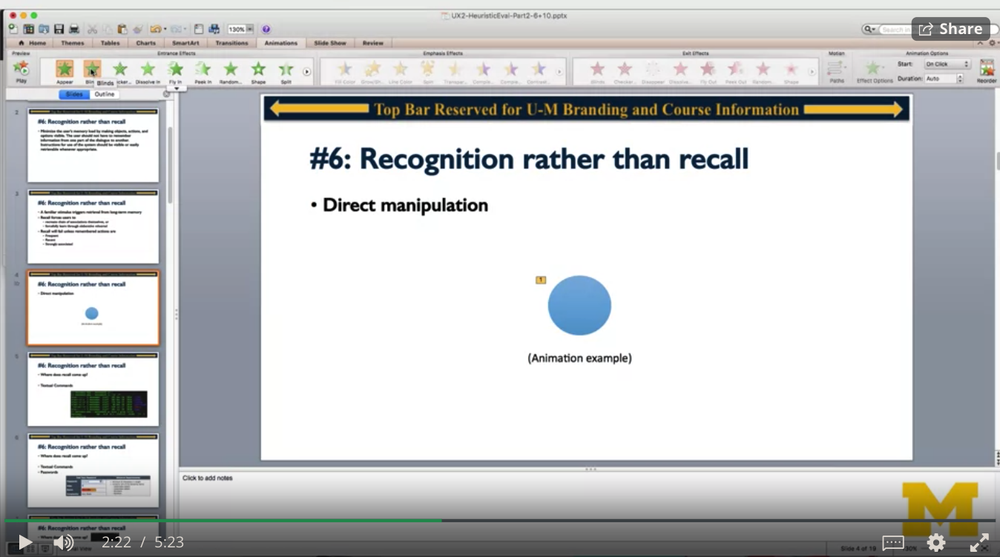
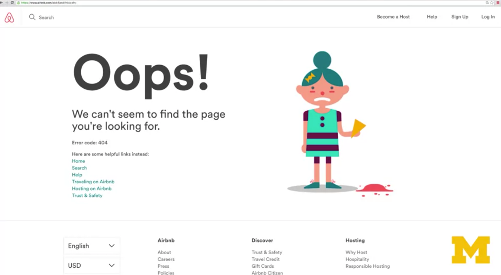
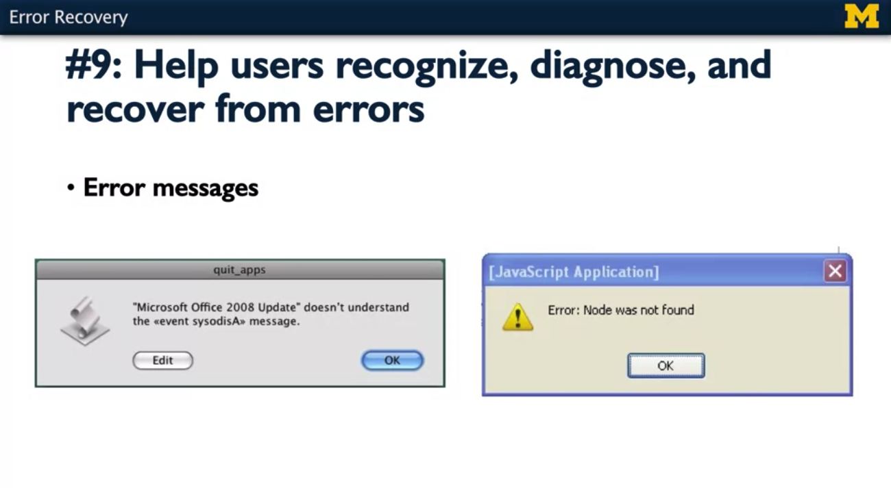
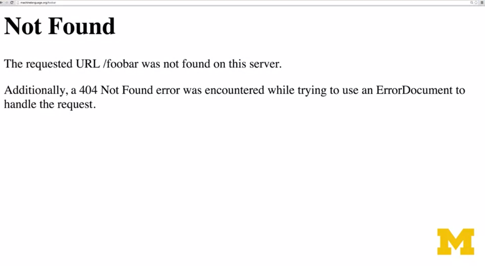

# WEEK 5: _Design Heuristics_

### Heuristics for Design

**From Knowledge to Guidelines** 

- Important to understand 
    - How people perceive 
    - How people remember 
    - How people act to pursue goals 

- How can system designs use this knowledge to inprove UX?
    - A: "Guidelines"

**Guidelines**

- There are many guidelines out there
    - Example: http://guidelines.usbility.gov/
    - Example: https://developer.android.com/design/index.html

- You could use any set of guidelines for an inspection 

- Choosing guidelines 
    - Are they well-supported and focused on user experience? 
    - Do they cover all the inmportant best practices? 
    - Do they apply to your platform/situation? 
    - Are they easy to use? 

**Jakob Nielsen's 10 Heuristics** 

- "Heuristic" means "rule of thumb" 
    - Slightly more general than a "guideline" 
- Derived from a systematic review of usability problems
- Intended to be a small, complete, and usable set 
- Able to be taught in a few hours
    - (though you get better with practice) 
- Well-supported by theories of perception and cognition

 

---

### #1: Visibility of System Statues

**Visibility of System Statuses**

- Why? 
- Knowing that actions are available bridges the Gulf of Execution
- Knowing how the system responded bridges the Gulf of Evaluation 
- Echoes Norman's principles of Feedback and Constraints 

- **Feedback** 
    - Ex: Mouse hovering 

- **Available actions**
    - Things that you can do and can not do

- **General Availability** 
    - busy indicator 

  

  - How users react to delay
    - Less than 100 milliseconds: "instantaneous" 
    - Up to 1.0 second: tolerable, but delay noticeable
    - Up to 10 seconds: annoying, but willing to wait 
    - More than 10 seconds: focus lost. on to something else 

- **Design guidelines** 
    - Strive for <100 msec response time 
    - Up to 1 second, no indicator needed 
    - From 1 o 10 seconds, use wait cursor 
    - Over 10 seconds, complete in the background, use progress indicators and estimates

---
### #2: Match Between System and Real World 

**#2: Match Between System and Real World**
- The system should speak the users' language, with words. phrases, and concepts familiar to the user, rather than system-oriented terms. Follow real-world conventions, making information appear in a natural and logical order. 

**Why?** 

1. Why is this important? Well, first, it allows us to take advantage of users existing schema or the associations that they already have between different pieces of information and how they're connected to goals and actions.

2. It also allows us to leverage perceived affordances and signifiers that suggest actions that are familiar to the users.

3. Reduces the difficulty of forming effective conceptual models because we're taking advantage of conceptual models that users already have.

4. It also allows us to leverage perceived affordances and signifiers that suggest actions that are familiar to the users, and it reduces the difficulty of forming effective conceptual models because we're taking advantage of conceptual models that users already have.

**Language**
Use words and phrases that are familiar to the user not system-oriented language.

**Metaphors**

So, for example, the user might infer that the shopping cart would also allow them to add multiple items, and to remove items, and even to abandon their cart without buying anything.

The document metaphor might suggest to users that they not only can create and save files, they can also delete them, they can copy them, and they can send or share them with other people.

It's important to make sure that systems that we design match the real-world expectations of users, so that they can take advantage of what they know from the real world and use it to effectively use the systems that we design.

---
### #3 - User Control and Freedom

**#3: User control and freedom** 

Why? 

- Mistakes are inevitable
- Support the 7 stages of action by allowing reformulated goals 
- Users employ trial and error to learn a new system 

### #4 - Consistency and Standards

**#4 - Consistency and Standards**

Users should not have to wonder whether different words. situations, or actions mean the same thing. Follow platform conventions. 

Why? 

- Leverage users' schemas 
- Present a coherent conceptual model 

Being consistent allows us to present a coherent conceptual model, which makes it easier for users to learn how to operate the system effectively. 

Ex: 
"Search" vs "Submit query"
"Save" vs "Commit" 
"Crate" vs "New"

It's also important when designing a series or a suite of products to maintain consistency across those products, and we looked at this in an earlier lecture; but, for example, looking at the different Google apps for word processing and for spreadsheets, we see that a very similar layout is used for the menu bar and the formatting options. 

By deciding not to follow platform conventions, these website designers have created a system that's harder to use and harder to learn for somebody just coming to the system for the first time. 

---

### #5: Error Prevention 

**#5: Error Prevention**

Even better than good error messages is careful design which prevents a problem from occurring in the place. Either eliminate error-prone conditions or check for them and present users with confirmation option before they commit to the action. 

Why? 

Mistakes are common 
People don't see of read everything on the screen 
People make mistakes when typing, clicking, etc. 

Preventing Errors before they happen if it's something risky. 

So, the key here is, wherever possible, you should try to prevent errors before they even happen, rather than just waiting for them to happen and helping users recover from it.

---

### #6 Recognition Over Recall 

**#6 Recognition Over Recall**

Minimize the user's memory load by making objects, actions, and options visible. The user should not have to remember information from one part of the dialogue to another. Instructions for use of the system should be visible or easily retrievable whenever appropriate.

Why?

- **_A familiar stimulus triggers retrieval from long-term memory_** 
    - **Recall forces users to**
        - recrate chain of associations themseles, or 
        - forcefully learn through elaborative rehearsal

- **Recall will fail unless remembered actions are** 
    - Frequent 
    - Recent 
    - Strongly associated

 The image above is an example of a direct manipulation interface, which is the style of interface that most graphical user interfaces use. A direct manipulation interface provides all of the objects that we might want to manipulate and all of the operations we might want to perform as visible options on the screen so that we can always recognize what it is that we need to do rather than having to recall it. And most interfaces work this way, and you want to make sure that your interfaces do, as well.
    
**Place Recall comes up**
- The command line
- passwords
- Speech UIs

So to sum up, we want to use recognition, not recall wherever possible.
Play video starting at :5:10 and follow transcript5:10
And if recall is required ask yourself, is it realistic to expect users to remember what you're asking them to remember? And are cues provided if recall fails? 

---

### #7 Flexibility and Efficiency of Use

**#7 - Flexibility and Efficiency of Use**

Accelerators - unseen by the novice user - may often speed up the interaction for the expert user such that the system can cater to both inexperienced and experienced users. Allow users to tailor frequent actions. 

Why? 

- Recall is bad for new/infrequent users, but can be fast for experts 

- Different users have different goals, allow them to customize 
    - But don't force them to! 

The need for hot keys!

- Bookmarks and customization 

---

### #8 - Aesthetic and Minimalist Design 

**#8 Aesthetic and Minimalist Design**

Dialogues should not contain information which is irrelevant of rarely needed. Every extra unit of information in a dialogue competes with the relevant units of information and diminishes their relative visibility. 

Why? 
- Visual clutter makes it harder to find and focus on desired actions 
- Good use of color, shape,  motion, and gestalt principles guide the eye 
- The more there is to see, the less of it users will actually see

**Use gestalt principles for non-linear reading** 

it's important to use gestalt principles to support non linear reading of the page, so use aesthetic design to organize the page in a way that makes it easy for the user to skim through, skip around, ignore the information that they don't want and get right to the information that they do want. 

By making use of the visual principles in this course and by reducing visual clutter as much as possible, we can make it easier for users to find the information and the opportunities for action that they need to find in order to have a better user experience.

---

### #9 - Error Recovery

**#9 - Error Recovery**

Help users recognize, diagnose, and recover from errors

- Error messages should be expressed in plain language (no coder language), precisely indicate the problem, and constructively suggest a solution

Why? 
#9 is a special case of #1,#2,#3, and #5
1. #1 Give Feedback 
2. #2 Speak the user' language
3. #3 Allow users to undo and escape from mistakes
4. #5 Prevent and detect errors 

Make sure any errors that are displayed makes sense to the user. 

**Good Example**

**Not clear to users #1**

**Not clear to users #2**

---
### #10 - Help and Documentation

**#10 - Help and Documentation**

Even though it is better if the system can be used without documentation, it may be necessary to provide help and documentation. Any such information should be easy to search, focused on the user's task, list concrete steps to be carried out. and not be too large. 

Why?
Your UI might not be as self-explanatory as you thought 
- Structure to support Gulf of Execution:
    - Easy to search 
    - Contain list of action 
    - Focused on user's tasks

Best if help is not needed
If required, make sure help is 
- Searchable 
- Task-focused
- Concrete steps to help them accomplish the things they need to get done. 

Prioritizing 
Highlight top 5-10 problems 
Ranked in the decreasing order of severity 
Use Heuristics to explain why they matter 

