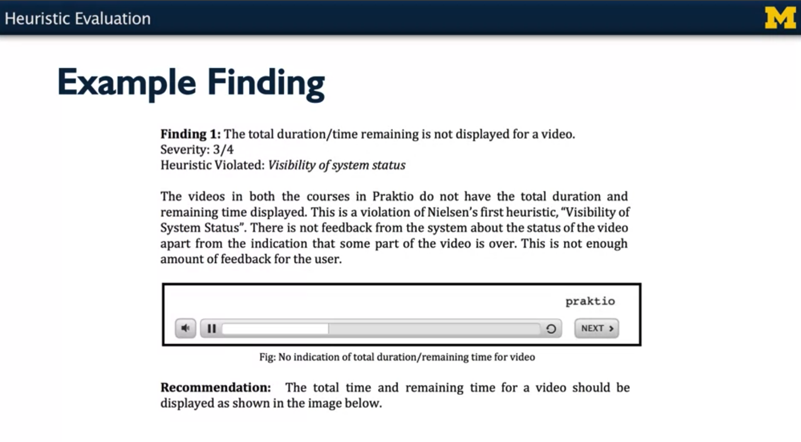

# WEEK 6: _Heuristic Evaluation and Course Wrap Up_

### Heuristic Evaluation

A Discount UX Research method 
- It's cheap
- Fast 
- No users! 

An "inspection" method
- A systematic "close read" of a user interface
- Apply heuristics 

**How it works**
- Choose a set of screens/interactions for focus 
- Step through, applying heuristics to find potential problems 
    - Be sure to test error cases
    - Be sure to look at help system (if any)
- Write down all violations, big and small 
    - And the heuristics they violate 
- Assess the severity of each problem
- Create prioritized list of problem to fix

**Assessing Severity** 
1 = cosmetic problem: no real usability impact 
2 = minor usability problem; fix if there is time 
3 = major usability problem; important to  fix 
4 = usability catastrophe; imperative to fix

Above is a rating scale that's often used in heuristic evaluation that's just a four-point rating scale, ranging from one, which represents a cosmetic problem, no real usability impact, so something that's maybe just annoying, to four, which is a usability catastrophe, absolutely imperative to fix, because users will not be able to make successful use of the system if that problem isn't fixed.

So, here's an example of the kind of problem that you can find with a heuristic evaluation and how you might communicate that to the designer of a system so they will know what needs to be fixed and how to fix it.

**_Finding 1:_** the finding is that the total duration or time remaining is not displayed in the video player that's embedded in this particular site.

**_Severity Rating:_** The severity of this issue has been rated a three out of four, indicating that it's a pretty serious problem, but it's not necessarily a showstopper.

**_Heuristic Violation:_** The heuristic that's been violated is the visibility of system status because the user is not able to tell how much of the video they have seen and how much is left.

**_Summary:_** A more detailed description is offered, saying that the videos in the courses do not have the total duration displayed, explains how this violates the heuristic of visibility of system status.

**_Screenshot:_** A screenshot is offered to indicate precisely where in the interface this problem occurs.

**_Recommendation:_** Finally, a recommendation is offered about how this might be fixed.

**Prioritizing** 
- Highlight to 5-19 problems 
- Ranked in decreasing order of severity 
- Use heuristics to explain why they matter 

**Multiple Evaluators are Better** 
- One evaluator finds 35% of "true" problems 
- Five evaluators find 75%
- Ten evaluators find 85%
- Sweet spot between 3 - 5 
- Solo evaluation can be very valuable

**Heuristic Evaluation vs User Testing**
- Cheap 
- Fast 
- Don't "use up" potential users 

The advantages are that heuristic evaluation is generally cheaper, faster, and you don't have to use up potential users.

**User Testing** 
- More realistic 
- Find more problems 
- Assess other UX qualities beyond usability

User testing, on the other hand, is more realistic. You generally find more problems than you find through heuristic evaluation. User testing allows you to assess other user experience qualities beyond usability such as usefulness, desirability, and so forth. 

Both heuristic evaluation and user testing, along with other UX methods, are typically used in an iterative design and evaluation process. 

To conclude, heuristic evaluation is a quick and inexpensive method to find significant flaws in a user interface. To perform a heuristic evaluation, you use **_Nielsen's heuristics_**, you inspect each screen or each state of the user interface, including erroneous inputs and the help system, document each violation, and assess the severity of those violations. Then, you prioritize the biggest problems that you found and document them in a way that will help guide further development and further improvements of the user interface.

